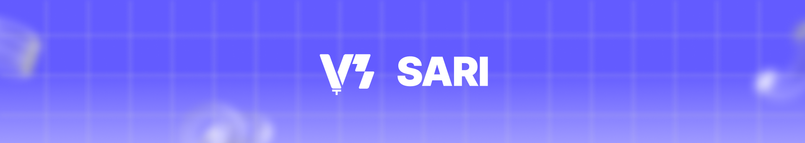

<!-- Banner -->

<!-- Overview -->

  <h1><b>SARI: An Augmented Reality E-commerce Mobile Application as a UPLB Marketplace</b></h1>
  <b>SARI</b> is a mobile application that <b>creates 3D versions</b> of your product using <b>photogrammetry</b> and view them in your space using <b>augmented reality.</b>

 

<!-- App UI -->

<!-- Technology Stack -->

  <b style="margin-right: 0.7rem;">Development:</b>
  

<!-- Download -->
 
 

> [!NOTE]
> To learn more about the project, scan the **QR code** below or go to **[this website](https://sites.google.com/up.edu.ph/sari/).**

  

